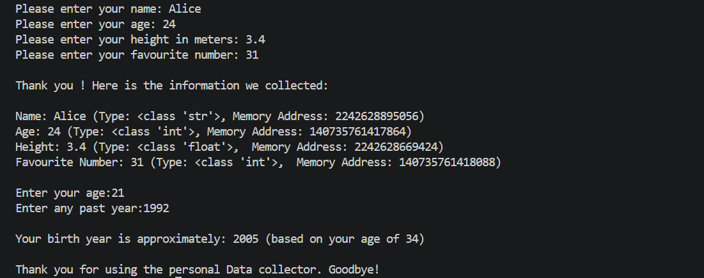

# python-task-project1
# PR. 1 Fundamental Booster - Personal Data Collector

This project is a command-line Python application designed to collect user data, analyze its properties (data types and memory addresses), and perform calculations like estimating the user's birth year.

## Features
- Collects personal details: Name, Age, Height, and Favourite Number.
- Displays the exact Python data type (`str`, `int`, `float`) for each input.
- Displays the dynamic memory address (`id()`) of each variable.
- Calculates and prints the approximate birth year based on the inputs provided.

## Assumptions
- The program calculates the approximate birth year using the logic requested in the project assignment output screenshot.
- Inputs for Age and Favourite Number are expected to be integers, and Height as a float value.

## Sample output 

